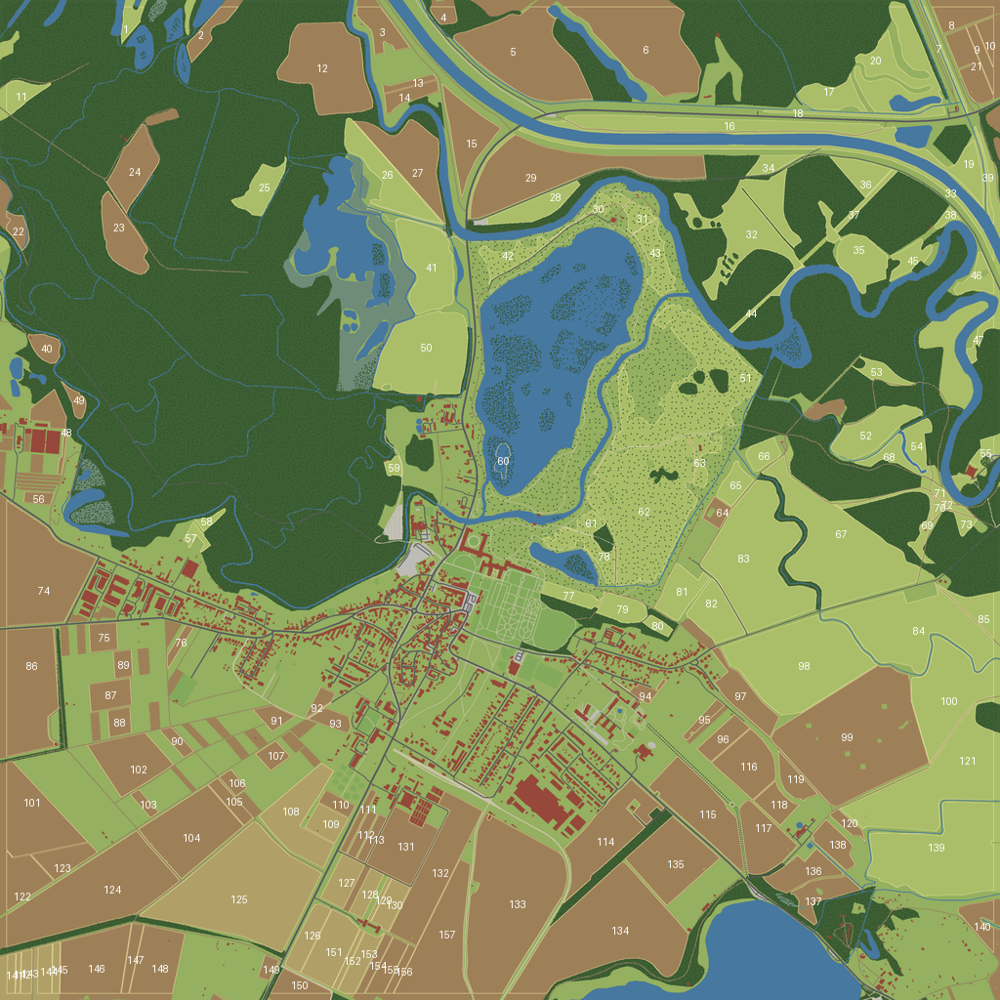

# FS25 Lednice – mapa pro Farming Simulator 25 podle skutečné obce

Mapa **4x (4096 × 4096 m)** obce **Lednice** (okres Břeclav, jižní Morava) postavená z reálných
geodat: skutečné ulice, domy, pole, louky, vinice, rybníky, **zámek Lednice**, **zámecká zahrada**
a **zámecký park** s Minaretem, Janovým hradem, Čínským pavilonem i Zámeckou Dyjí.



## Co je v repozitáři

| Cesta | Obsah |
|---|---|
| `generator/` | Python skripty: stažení dat, generování všech podkladů mapy, instalace do šablony |
| `data/raw/` | Stažená reálná data (GeoJSON z Overture Maps / OpenStreetMap, výškopis) – build funguje offline |
| `FS25_Lednice/` | **Vygenerované podklady mapy** (výsledek `build_map.py`) |
| `FS25_Lednice/maps/data/dem.png` | výškopis 4097 × 4097 px, 16 bit, 1 m/px (heightScale 255) |
| `FS25_Lednice/maps/data/lednice_*_weight.png` | 13 texturových masek terénu 8192 × 8192 (0,5 m/px) |
| `FS25_Lednice/maps/data/infoLayer_farmlands.png` + `maps/config/farmlands.xml` | pozemky k nákupu (1 pole = 1 pozemek) |
| `FS25_Lednice/import/buildings.i3d` | **3D modely všech ~1 800 budov** (výšky podle podlaží, sedlové/valbové střechy, zámek, Minaret s věží 62 m, kostel sv. Jakuba …) |
| `FS25_Lednice/import/roads.i3d` | ~600 silnic a cest jako **spline křivky** (skupiny podle třídy: secondary, tertiary, residential, track, footway …) |
| `FS25_Lednice/import/fields.i3d` + `fields.json` | **pole** (polygony FS25 `polygonPoints`) – orná půda, louky, vinice, sady |
| `FS25_Lednice/import/water.i3d` | vodní hladiny rybníků a Zámecké Dyje ve správné výšce |
| `FS25_Lednice/import/trees.csv` | pozice ~stromů (lužní les, zámecký park, stromořadí) |
| `FS25_Lednice/maps/overview.dds`, `icon_Lednice.dds` | mapa pro PDA a ikona módu |
| `ge_scripts/` | Lua skripty pro Giants Editor (rozmístění stromů z CSV, posazení objektů na terén) |

### Co přesně obsahuje mapa

* **Terén** – reálný výškopis (AWS Terrain Tiles), vyhlazený; silnice mají srovnaný příčný sklon,
  parcely domů jsou zarovnané, rybníky a toky mají vyhloubená koryta pod hladinou.
* **Textury** – asfalt (silnice), dlažba/beton (náměstí, chodníky, parkoviště), štěrk (parkové cesty,
  železnice), polní cesty, pole, vinice/sady, louky, lužní les, křoviny, mokřady, zahrady, břehy.
* **Budovy** – z půdorysů OSM, výška z počtu podlaží/výšky, jinak odhad podle typu.
  Střechy: sedlové / valbové (tašky, břidlice, plech), ploché u garáží a složitých půdorysů.
  Významné stavby mají ručně doplněné rozměry (zámek, Minaret, kostel, jízdárny, skleník,
  Maurská vodárna, Janův hrad, Lovecký zámeček, Čínský pavilon, Hubertova šopa).
* **Pole** – 115 polí orné půdy + louky, vinice a sady z OSM (min. 0,5 ha); každé má svůj pozemek.

## Postup – jak z toho udělat hratelnou mapu

**Podrobný návod krok za krokem pro začátečníky: [docs/POSTUP.md](docs/POSTUP.md)**

FS25 mapa potřebuje soubory, které vytváří jen **Giants Editor** (binární density mapy `.gdm`,
nastavení shaderů terénu, fyziku, …). Proto se podklady vkládají do **oficiální prázdné šablony mapy**.

1. **Nainstalujte Giants Editor 10 (FS25)** – zdarma na <https://gdn.giants-software.com> (Downloads).
2. **Stáhněte šablonu mapy FS25** z GDN (Map Template / sample mod map) a rozbalte ji do
   `Documents/My Games/FarmingSimulator2025/mods/FS25_Lednice/` (pracujte na kopii).
3. **Vložte data Lednice do šablony:**
   ```bash
   pip install numpy pillow
   python generator/install_to_template.py "C:/Users/<vy>/Documents/My Games/FarmingSimulator2025/mods/FS25_Lednice"
   ```
   Skript nahradí výškopis, texturové masky (přiřadí je k vrstvám šablony podle názvu – asphalt01,
   grass01, mudDark01, forestGrass01, gravel01 …), pozemky, přehledku, ikonu, název a rozměr mapy
   a zkopíruje importní soubory do `lednice_import/`. Vypíše přehled, co kam přiřadil.
4. **Otevřete `maps/map.i3d` v Giants Editoru.** Terén má tvar Lednice.
   Pokud šablona byla 2x (2048 m), viz *Velikost mapy* níže.
5. **File → Import** postupně:
   * `lednice_import/buildings.i3d` – budovy (jsou již ve správné výšce, se statickou kolizí),
   * `lednice_import/water.i3d` – vodní hladiny; přiřaďte jim materiál vody ze šablony
     (vyberte hladinu ze šablony → Material Editor → zkopírovat materiál),
   * `lednice_import/roads.i3d` – spline křivky pro AI dopravu / chodce nebo jako vodítko
     pro umístění silničních meshů,
   * `lednice_import/fields.i3d` – přetáhněte uzly `field01…` do skupiny `fields` šablony
     (smažte ukázková pole šablony). Seznam polí s výměrou je ve `fields.json`.
6. **Stromy:** do scény načtěte několik stromů ze hry (dub, jasan, lípa, topol – lužní les), označte
   je a spusťte skript `lednice_import/ge_scripts/lednicePlaceTrees.lua`
   (Scripts → nejdřív upravte cestu k `trees.csv` v hlavičce skriptu).
7. V Giants Editoru: **Terrain → Paint** doladit detaily, **Foliage** namalovat trávu na louky
   a do parku, na pole nechat ornou půdu. U vinic umístit vinné keře (placeable *Grapes*).
8. Uložte (Ctrl+S), spusťte hru → nová hra → mapa **Lednice**.

### Velikost mapy

Mapa je generována jako **4x (4096 m)**, protože obec i se zámeckým parkem, Minaretem, Janovým
hradem a okolními poli měří cca 4 × 3,5 km. Pokud je vaše šablona 2x (dem 2049 px):

* v Giants Editoru použijte *Terrain → Resize / Change terrain size* (nebo začněte ze 4x šablony),
* density mapy (`densityMap_*.gdm`, `infoLayer_*.grle`) musí mít dvojnásobné rozlišení –
  převeďte je nástrojem `grleConverter` (součást instalace Giants Editoru) do PNG,
  zvětšete 2× (nearest neighbour) a převeďte zpět.

Alternativně lze vygenerovat menší 2x výřez: v `generator/config.py` nastavte `MAP_SIZE = 2048`
(a případně posuňte `CENTER_LAT/LON`) a spusťte build znovu – obsáhne centrum, zámek a park po Minaret.

## Regenerace dat

```bash
pip install numpy scipy pillow shapely pyproj pyarrow
python generator/fetch_overture.py   # stáhne budovy, silnice, využití půdy, vodu (Overture Maps, S3)
python generator/fetch_dem.py        # stáhne výškopis (AWS Terrain Tiles)
python generator/build_map.py        # vygeneruje FS25_Lednice/ (~2–4 min)
```

Nastavení (střed, velikost mapy) je v `generator/config.py`, výšky významných staveb
v `LANDMARKS` v `generator/build_map.py`.

## Omezení (upřímně)

* Budovy jsou **zjednodušené modely** (barevné stěny a střechy bez textur, bez oken). Věrně sedí
  půdorysem, polohou a přibližnou výškou. Pro hezčí vzhled je lze postupně nahrazovat placeables
  ze hry – polohy zůstanou jako vodítko.
* Výškopis má zdrojové rozlišení ~30 m (Lednice je rovinatá niva Dyje, převýšení ~40 m) –
  terén je věrný v celku, drobné terénní hrany chybí.
* Silnice jsou texturou v terénu + spline; zakřivené 3D silniční meshe nejsou (v FS25 se běžně řeší
  texturou, jako na základních mapách).
* Mapu nelze v tomto prostředí otestovat přímo ve hře ani v Giants Editoru (běží jen na Windows/macOS).

## Zdroje dat a licence

* Budovy, silnice, využití půdy, voda: **© přispěvatelé OpenStreetMap** (ODbL), distribuováno přes
  [Overture Maps Foundation](https://overturemaps.org) (release 2026-09-23.1).
* Výškopis: [AWS Terrain Tiles](https://registry.opendata.aws/terrain-tiles/) (Mapzen; zdroje SRTM, EU-DEM aj.).
* Mapa i data jsou odvozené dílo pod ODbL – při publikaci (např. ModHub) uveďte „© OpenStreetMap contributors“.
